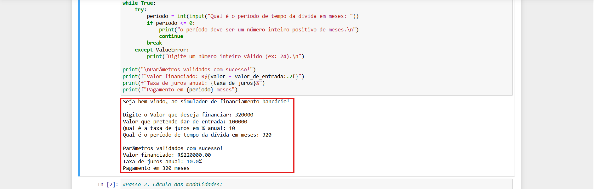
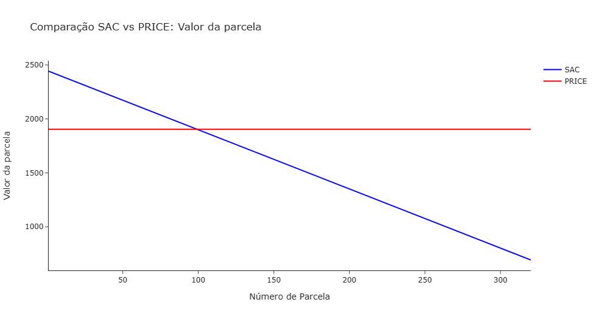
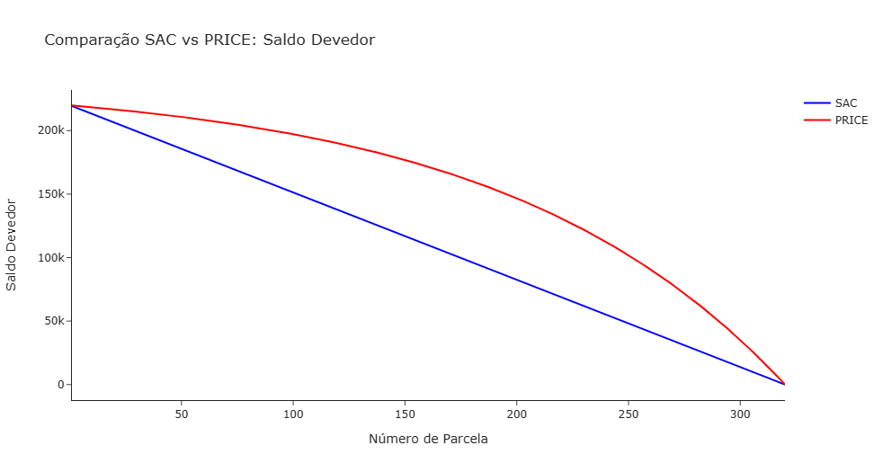
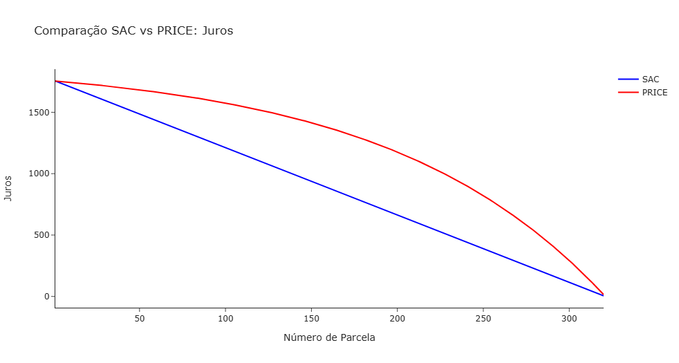

<<<<<<< HEAD
#🏦 Simulador de Financiamento SAC vs Price  
*(por Vitor Barbosa)*  

🔍 **Compare sistemas de amortização e descubra qual é o mais vantajoso para você!**
 
## 💻 Como Usar  
1. Abra o arquivo `Projeto_SAC_PRICE.ipynb` no **Jupyter Notebook**.  
2. Siga as instruções na tela para inserir:  
   - Valor do financiamento  
   - Entrada  
   - Taxa de juros anual  
   - Período em meses  
3. Veja os tabelas e gráficos gerados automaticamente!

  
*Exemplo da interface do programa*

---

## 📈 Funcionalidades  
- Comparação **SAC** (parcelas decrescentes) vs **Price** (parcelas fixas)  
- Gráficos interativos de:  
  - Valor da parcela  
  - Saldo devedor  
  - Juros pagos  
- Cálculo do **total economizado** com cada sistema  

---

## 📊 Resultados  

### Gráfico 1: Valor das Parcelas  
  
*SAC (azul) tem parcelas decrescentes, enquanto PRICE (vermelho) mantém o valor fixo.*  

### Gráfico 2: Saldo Devedor  
  
*No SAC, o saldo diminui mais rapidamente.*

### Gráfico 3: Juros Pagos  
  
*PRICE concentra juros nas primeiras parcelas.*

## ⚙️ Instalação  
1. Instale o Python: [python.org](https://www.python.org/)  
2. Instale as bibliotecas:  
   ```bash
   pip install pandas numpy plotly jupyter
   ```
---

Feito com empenho 💪🏼 por Vitor Barbosa  
📧 **Contato:** vitor.bssilva2002@gmail.com
=======
# Simulador-financiamento
Simulador SAC vs Price em Python
>>>>>>> be5063e0d57ac0e6a560e1b5845f5437b0ad2be7
